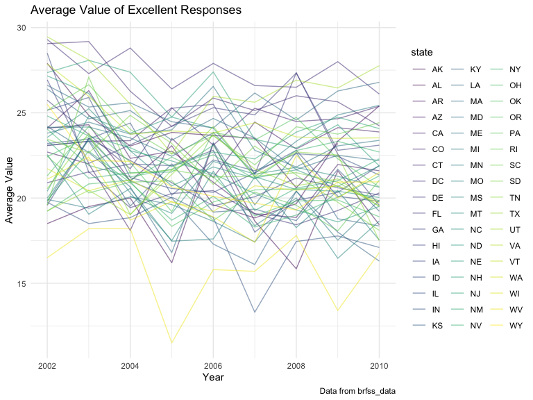
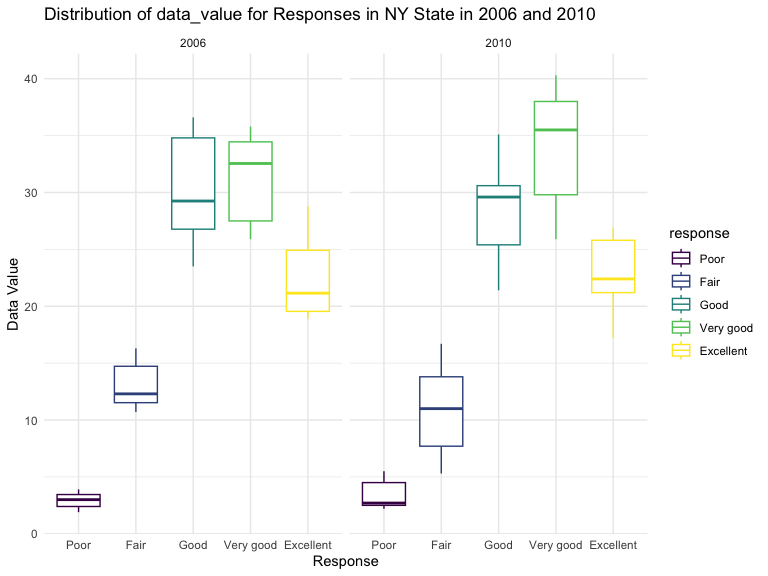
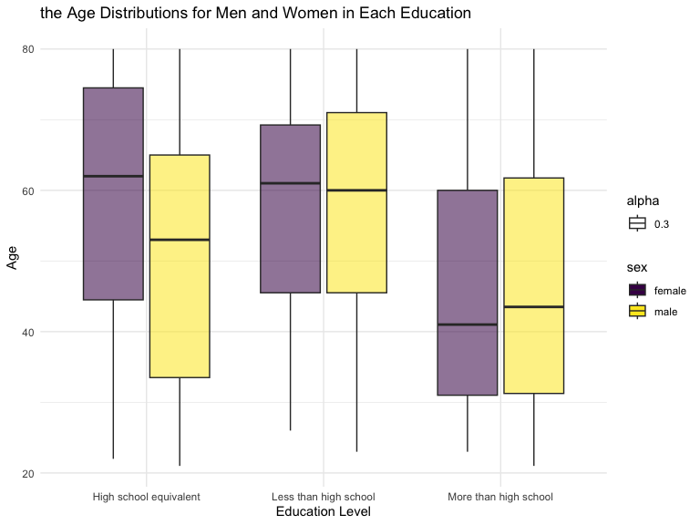
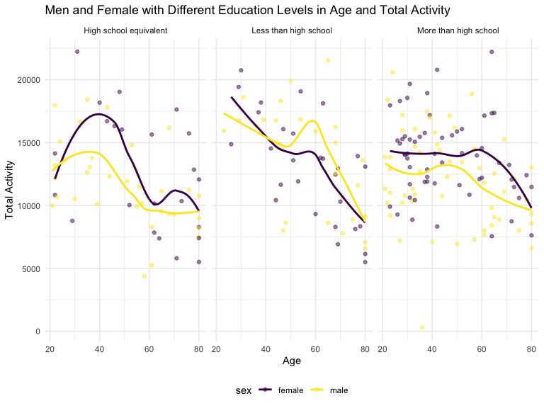
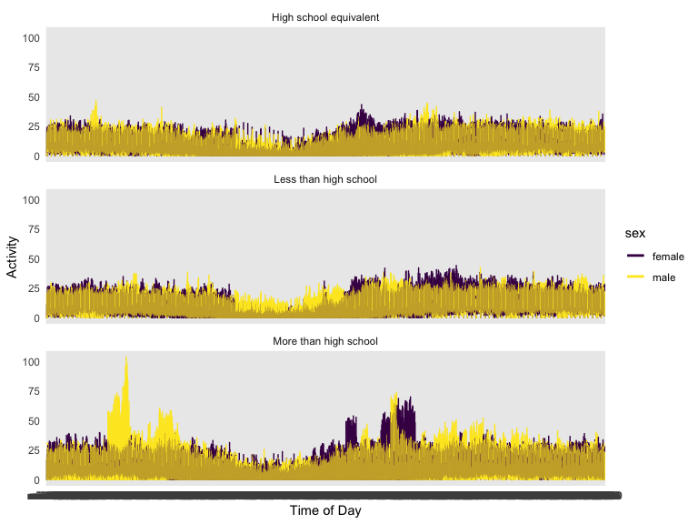

p8105_hw3_sc5351
================
Shaoyu Chen
2023-10-13

\##Problem 1

``` r
data("instacart")
instacart = 
  instacart |> 
  as_tibble()
```

The size of the dataset is 1384617rows and 15 columns. The important
varables are `order_id`, `product_id`, `add_to_cart_order`, `reordered`
and `user_id`.There are several order-level variables, describing the
day and time of the order, and number of days since prior order. Then
there are several item-specific variables, describing the product name
(e.g. Yogurt, Avocado), department (e.g. dairy and eggs, produce), and
aisle (e.g. yogurt, fresh fruits), and whether the item has been ordered
by this user in the past. In total, there are 39123 products found in
131209 orders from 131209 distinct users.

Below is a table summarizing the number of items ordered from aisle. In
total, there are 134 aisles, with fresh vegetables and fresh fruits
holding the most items ordered by far.

``` r
instacart |> 
  count(aisle) |> 
  arrange(desc(n))
```

    ## # A tibble: 134 × 2
    ##    aisle                              n
    ##    <chr>                          <int>
    ##  1 fresh vegetables              150609
    ##  2 fresh fruits                  150473
    ##  3 packaged vegetables fruits     78493
    ##  4 yogurt                         55240
    ##  5 packaged cheese                41699
    ##  6 water seltzer sparkling water  36617
    ##  7 milk                           32644
    ##  8 chips pretzels                 31269
    ##  9 soy lactosefree                26240
    ## 10 bread                          23635
    ## # ℹ 124 more rows

Below is a plot that shows the number of items ordered in each aisle.

``` r
instacart |> 
  count(aisle) |> 
  filter(n > 10000) |> 
  mutate(aisle = fct_reorder(aisle, n)) |> 
  ggplot(aes(x = aisle, y = n)) + 
  geom_point() + 
  labs(title = "Number of items ordered in each aisle") +
  theme(axis.text.x = element_text(angle = 60, hjust = 1))
```


Below is a table showing the three most popular items in each of the
aisles “baking ingredients”, “dog food care”, and “packaged vegetables
fruits”.

``` r
instacart |> 
  filter(aisle %in% c("baking ingredients", "dog food care", "packaged vegetables fruits")) |>
  group_by(aisle) |> 
  count(product_name) |> 
  mutate(rank = min_rank(desc(n))) |> 
  filter(rank < 4) |> 
  arrange(desc(n)) |>
  knitr::kable()
```

| aisle                      | product_name                                  |    n | rank |
|:---------------------------|:----------------------------------------------|-----:|-----:|
| packaged vegetables fruits | Organic Baby Spinach                          | 9784 |    1 |
| packaged vegetables fruits | Organic Raspberries                           | 5546 |    2 |
| packaged vegetables fruits | Organic Blueberries                           | 4966 |    3 |
| baking ingredients         | Light Brown Sugar                             |  499 |    1 |
| baking ingredients         | Pure Baking Soda                              |  387 |    2 |
| baking ingredients         | Cane Sugar                                    |  336 |    3 |
| dog food care              | Snack Sticks Chicken & Rice Recipe Dog Treats |   30 |    1 |
| dog food care              | Organix Chicken & Brown Rice Recipe           |   28 |    2 |
| dog food care              | Small Dog Biscuits                            |   26 |    3 |

Below is a table showing the mean hour of the day at which Pink Lady
Apples and Coffee Ice Cream are ordered on each day of the week.

``` r
instacart |>
  filter(product_name %in% c("Pink Lady Apples", "Coffee Ice Cream")) |>
  group_by(product_name, order_dow) |>
  summarize(mean_hour = mean(order_hour_of_day)) |>
  pivot_wider(
    names_from = order_dow, 
    values_from = mean_hour) |>
  knitr::kable(digits = 2)
```

    ## `summarise()` has grouped output by 'product_name'. You can override using the
    ## `.groups` argument.

| product_name     |     0 |     1 |     2 |     3 |     4 |     5 |     6 |
|:-----------------|------:|------:|------:|------:|------:|------:|------:|
| Coffee Ice Cream | 13.77 | 14.32 | 15.38 | 15.32 | 15.22 | 12.26 | 13.83 |
| Pink Lady Apples | 13.44 | 11.36 | 11.70 | 14.25 | 11.55 | 12.78 | 11.94 |

\##Proble 2 Data cleaning

``` r
data("brfss_smart2010")
brfss_data <-
  brfss_smart2010|>
  janitor::clean_names()|>
  rename("state"="locationabbr" , "location"="locationdesc") |>
  filter(topic=='Overall Health')|>
  filter(response %in% c("Excellent","Very good","Good","Fair","Poor"))|>
  mutate(response = factor(response, levels = c("Poor", "Fair", "Good", "Very good", "Excellent")))
brfss_data
```

    ## # A tibble: 10,625 × 23
    ##     year state location     class topic question response sample_size data_value
    ##    <int> <chr> <chr>        <chr> <chr> <chr>    <fct>          <int>      <dbl>
    ##  1  2010 AL    AL - Jeffer… Heal… Over… How is … Excelle…          94       18.9
    ##  2  2010 AL    AL - Jeffer… Heal… Over… How is … Very go…         148       30  
    ##  3  2010 AL    AL - Jeffer… Heal… Over… How is … Good             208       33.1
    ##  4  2010 AL    AL - Jeffer… Heal… Over… How is … Fair             107       12.5
    ##  5  2010 AL    AL - Jeffer… Heal… Over… How is … Poor              45        5.5
    ##  6  2010 AL    AL - Mobile… Heal… Over… How is … Excelle…          91       15.6
    ##  7  2010 AL    AL - Mobile… Heal… Over… How is … Very go…         177       31.3
    ##  8  2010 AL    AL - Mobile… Heal… Over… How is … Good             224       31.2
    ##  9  2010 AL    AL - Mobile… Heal… Over… How is … Fair             120       15.5
    ## 10  2010 AL    AL - Mobile… Heal… Over… How is … Poor              66        6.4
    ## # ℹ 10,615 more rows
    ## # ℹ 14 more variables: confidence_limit_low <dbl>, confidence_limit_high <dbl>,
    ## #   display_order <int>, data_value_unit <chr>, data_value_type <chr>,
    ## #   data_value_footnote_symbol <chr>, data_value_footnote <chr>,
    ## #   data_source <chr>, class_id <chr>, topic_id <chr>, location_id <chr>,
    ## #   question_id <chr>, respid <chr>, geo_location <chr>

States were observed at 7 or more locations in 2002.

``` r
state_2002 =
  brfss_data|>
  filter(year == "2002")|>
  group_by(year,state)|>
  summarize(count_locations = n_distinct(location))|>
  filter(count_locations > 6)|>
  knitr::kable(digit = 2)
```

    ## `summarise()` has grouped output by 'year'. You can override using the
    ## `.groups` argument.

``` r
state_2002
```

| year | state | count_locations |
|-----:|:------|----------------:|
| 2002 | CT    |               7 |
| 2002 | FL    |               7 |
| 2002 | MA    |               8 |
| 2002 | NC    |               7 |
| 2002 | NJ    |               8 |
| 2002 | PA    |              10 |

States were observed at 7 or more locations in 2010.

``` r
state_2010 = 
  brfss_data|>
  filter(year == "2010")|>
  group_by(year,state)|>
  summarize(count_locations = n_distinct(location))|>
  filter(count_locations > 6)|>
  knitr::kable(digit = 2)
```

    ## `summarise()` has grouped output by 'year'. You can override using the
    ## `.groups` argument.

``` r
state_2010
```

| year | state | count_locations |
|-----:|:------|----------------:|
| 2010 | CA    |              12 |
| 2010 | CO    |               7 |
| 2010 | FL    |              41 |
| 2010 | MA    |               9 |
| 2010 | MD    |              12 |
| 2010 | NC    |              12 |
| 2010 | NE    |              10 |
| 2010 | NJ    |              19 |
| 2010 | NY    |               9 |
| 2010 | OH    |               8 |
| 2010 | PA    |               7 |
| 2010 | SC    |               7 |
| 2010 | TX    |              16 |
| 2010 | WA    |              10 |

In 2002, CT, FL, MA, NC, NJ, and PA (totally 6) were observed at 7 or
more locations. In 2010, FL, MA, MD, NC, NE, NJ, NY, OH, PA, SC, TX and
WA (totally 14) were observed at 7 or more locations.

Then construct a dataset that is limited to Excellent responses, and
contains, year, state, and a variable that averages the data_value
across locations within a state.

``` r
spaghetti_data <- brfss_data |> 
  filter(response == "Excellent") |>
  group_by(year, state) |>
  summarise(average_value = mean(data_value, na.rm = TRUE), .groups = "drop")
spaghetti_data|>
  ggplot(aes(x = year, y = average_value, group = state)) + 
  geom_line(aes(color = state), alpha = .5) + 
  labs(
    title = "Average Value of Excellent Responses",
    x = "Year",
    y = "Average Value",
    caption = "Data from brfss_data"
  ) +
  theme(legend.position = "right")
```



Finally, make a two-panel plot showing, for the years 2006, and 2010,
distribution of data_value for responses (“Poor” to “Excellent”) among
locations in NY State.

``` r
plot_data <- brfss_data |>
  filter(year %in% c("2006", "2010"),state == "NY")|>
  select(year, state, location, response, data_value)
plot_data |>
  ggplot(aes(x = response,y = data_value, color=response))+
  geom_boxplot()+
  labs(
    x = "Response",
    y = "Data Value",
    title = "Distribution of data_value for Responses in NY State in 2006 and 2010"
  ) +
  facet_grid(.~year) +
  theme(legend.position = "right")
```



\##Problem 3 Load, tidy, merge, and otherwise organize the data sets.

``` r
covar_data =
  read_csv("./data/nhanes_covar.csv", skip = 4) |>
  janitor::clean_names() |>
  filter(age >= 21) |>
  drop_na()|>
  mutate(
    sex = case_when(
    sex == 1 ~ "male",
    sex == 2 ~ "female"
  ),
  education = case_when(
    education == 1 ~ "Less than high school",
    education == 2 ~ "High school equivalent",
    education == 3 ~ "More than high school"
  )) 
```

    ## Rows: 250 Columns: 5
    ## ── Column specification ────────────────────────────────────────────────────────
    ## Delimiter: ","
    ## dbl (5): SEQN, sex, age, BMI, education
    ## 
    ## ℹ Use `spec()` to retrieve the full column specification for this data.
    ## ℹ Specify the column types or set `show_col_types = FALSE` to quiet this message.

``` r
covar_data
```

    ## # A tibble: 228 × 5
    ##     seqn sex      age   bmi education             
    ##    <dbl> <chr>  <dbl> <dbl> <chr>                 
    ##  1 62161 male      22  23.3 High school equivalent
    ##  2 62164 female    44  23.2 More than high school 
    ##  3 62169 male      21  20.1 High school equivalent
    ##  4 62174 male      80  33.9 More than high school 
    ##  5 62177 male      51  20.1 High school equivalent
    ##  6 62178 male      80  28.5 High school equivalent
    ##  7 62180 male      35  27.9 More than high school 
    ##  8 62184 male      26  22.1 High school equivalent
    ##  9 62189 female    30  22.4 More than high school 
    ## 10 62199 male      57  28   More than high school 
    ## # ℹ 218 more rows

``` r
accel_data <-
  read_csv("./data/nhanes_accel.csv")|>
  janitor::clean_names() |>
  drop_na() 
```

    ## Rows: 250 Columns: 1441
    ## ── Column specification ────────────────────────────────────────────────────────
    ## Delimiter: ","
    ## dbl (1441): SEQN, min1, min2, min3, min4, min5, min6, min7, min8, min9, min1...
    ## 
    ## ℹ Use `spec()` to retrieve the full column specification for this data.
    ## ℹ Specify the column types or set `show_col_types = FALSE` to quiet this message.

``` r
accel_data
```

    ## # A tibble: 250 × 1,441
    ##     seqn  min1  min2  min3  min4   min5   min6  min7   min8    min9  min10
    ##    <dbl> <dbl> <dbl> <dbl> <dbl>  <dbl>  <dbl> <dbl>  <dbl>   <dbl>  <dbl>
    ##  1 62161 1.11  3.12  1.47  0.938 1.60   0.145  2.10  0.509   1.63   1.20  
    ##  2 62164 1.92  1.67  2.38  0.935 2.59   5.22   2.39  4.90    1.97   3.13  
    ##  3 62169 5.85  5.18  4.76  6.48  6.85   7.24   6.12  7.48    5.47   6.49  
    ##  4 62174 5.42  3.48  3.72  3.81  6.85   4.45   0.561 1.61    0.698  2.72  
    ##  5 62177 6.14  8.06  9.99  6.60  4.57   2.78   7.10  7.25   10.1    7.49  
    ##  6 62178 0.167 0.429 0.131 1.20  0.0796 0.0487 0.106 0.0653  0.0564 0.0639
    ##  7 62180 0.039 0     0     0     0.369  0.265  0.506 0.638   0      0.011 
    ##  8 62184 1.55  2.81  3.86  4.76  6.10   7.61   4.74  6.73    5.42   4.24  
    ##  9 62186 3.08  2.54  2.63  2.12  1.14   1.68   2.84  2.72    2.13   2.18  
    ## 10 62189 2.81  0.195 0.163 0     0.144  0.180  0.870 0.214   0      0     
    ## # ℹ 240 more rows
    ## # ℹ 1,430 more variables: min11 <dbl>, min12 <dbl>, min13 <dbl>, min14 <dbl>,
    ## #   min15 <dbl>, min16 <dbl>, min17 <dbl>, min18 <dbl>, min19 <dbl>,
    ## #   min20 <dbl>, min21 <dbl>, min22 <dbl>, min23 <dbl>, min24 <dbl>,
    ## #   min25 <dbl>, min26 <dbl>, min27 <dbl>, min28 <dbl>, min29 <dbl>,
    ## #   min30 <dbl>, min31 <dbl>, min32 <dbl>, min33 <dbl>, min34 <dbl>,
    ## #   min35 <dbl>, min36 <dbl>, min37 <dbl>, min38 <dbl>, min39 <dbl>, …

``` r
merged_data <- merge(covar_data, accel_data, by = "seqn")
```

Produce a reader-friendly table for the number of men and women in each
education category

``` r
covar_table <- covar_data |>
  group_by(sex, education) |>
  summarise(count = n()) |>
  pivot_wider( names_from = "sex", values_from = "count")|>
  knitr::kable(digits = 2)
```

    ## `summarise()` has grouped output by 'sex'. You can override using the `.groups`
    ## argument.

``` r
covar_table
```

| education              | female | male |
|:-----------------------|-------:|-----:|
| High school equivalent |     23 |   35 |
| Less than high school  |     28 |   27 |
| More than high school  |     59 |   56 |

There are totally 228 participants in this study, which have 110 female
and 118 male. Based on this table, we can see that male in high school
education level are more than female. However, The number of women with
education levels higher than high school and lower than high school is
greater than that of men.

Then, create a visualization of the age distributions for men and women
in each education category.

``` r
age_data <- covar_data |>
  select(sex,education,age) |>
  ggplot(aes(x = education, y = age)) + 
  geom_boxplot(aes(fill = sex, alpha = 0.3)) +
  labs(
    x = "Education Level",
    y = "Age",
    title = "the Age Distributions for Men and Women in Each Education"
    ) +
  theme(legend.position = "right")
age_data
```


According to this boxplot, we can find the younger participants trend to
have high education level.

Create a total activity plot

``` r
summary_data <- merged_data |>
  mutate(total_act = rowSums(across(min1:min1440), na.rm = TRUE)) |>
  ggplot(aes(x = age, y = total_act, color = sex)) +
  geom_point(alpha = 0.5) +
  geom_smooth(se = FALSE) +
  labs(
    title = "Men and Female with Different Education Levels in Age and Total Activity",
    x = "Age",
    y = "Total Activity"
  ) +
  facet_wrap(~education) 
summary_data
```

    ## `geom_smooth()` using method = 'loess' and formula = 'y ~ x'


Based on this plot, we can see that female with high school and more
than high school education level have more total activities than that of
male. However, male with less than high school education level have more
total activities than that of female.

Finally, make a three-panel plot that shows the 24-hour activity time
courses for each education level and use color to indicate sex.

``` r
whole_data <- merged_data |>
  pivot_longer(cols = starts_with("min"), names_to = "time", values_to = "activity")
three_panel_plot <- whole_data |>
  ggplot(aes(x = time, y = activity, color = sex))+
  geom_line() +
  labs(
     x = "Time of Day", y = "Activity") +
  geom_smooth(se = FALSE)+
  facet_wrap(~education, ncol = 1) +
  theme(legend.position = "right")
three_panel_plot
```

    ## `geom_smooth()` using method = 'loess' and formula = 'y ~ x'


Based on this plot, it shows that during noon and afternoon, women are
more active than men. And similar in other time periods.
